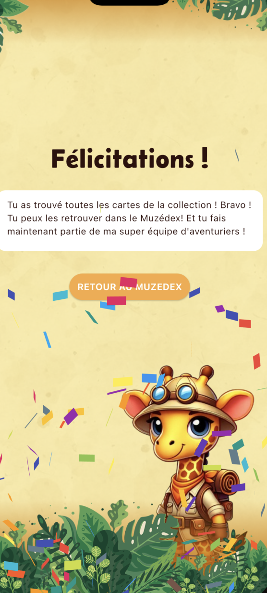

### RICHARD Mathieu - CORNUAULT Mathis - WARNET Melvin - CHAILLEUX Nathan - GAY Ulysse - DEMOUGE Colin - RAMAT Pierre  
**BUT 3 - Groupe Y11**  
**Projet SAE5 - Muzedex**

---

## Menu de navigation

1. [Présentation du projet Muzedex](#présentation-du-projet-muzedex)  
2. [Installation du projet en local](#installation-du-projet-en-local)  
   1. [Étape 1 : Clonage du projet](#étape-1--clonage-du-projet)  
   2. [Étape 2 : Lancement du projet Symfony](#étape-2--lancement-du-projet-symfony)  
   3. [Étape 3 : Lancement du projet Flutter](#étape-3--lancement-du-projet-flutter)  
3. [Présentation des fonctionnalités](#présentation-des-fonctionnalités)  
   1. [Partie Backend](#partie-backend)  
   2. [Partie Frontend](#partie-frontend)  
      - [Page d’accueil](#page-daccueil)  
      - [Tutoriel](#tutoriel)  
      - [Page Plan du Musée](#page-plan-du-musée)  
      - [Page Énigme](#page-énigme)  
      - [Mise à jour de la page Plan](#mise-à-jour-de-la-page-plan)  
      - [Page Muzedex](#page-muzedex)  
      - [Page détail d'un objet](#page-détail-dun-objet)  
      - [Fin du jeu](#fin-du-jeu)

---

## Présentation du projet Muzedex

Le projet **Muzedex** vise à répondre à la demande formulée par le consortium *Je Peux Pas J'ai Musée*, en partenariat avec le musée de La Rochelle. Cette demande consiste à réaliser une application mobile qui accompagne les visiteurs lors de leur visite. L'application doit également être ludique, offrir un objectif stimulant et s'adresser aux enfants de 7 à 12 ans.

L'architecture du projet, imposée par le musée, est divisée en deux parties :

- **Frontend** : développé en Flutter (Dart) selon le principe de découpage atomique.  
- **Backend** : développé en Symfony (PHP) avec une base de données accessible via une API implémentée grâce à l’outil API Platform.

---

## Installation du projet en local

### Étape 1 : Clonage du projet

Commencez par cloner le projet sur votre machine. Exécutez la commande suivante dans le dossier où vous souhaitez cloner le projet :

```bash
git clone git@forge.iut-larochelle.fr:labs-iut-info/etudiants/2024-2025-but-info3-a-sae56/y1/y11/muzedex.git
```

### Étape 2 : Lancement du projet Symfony

Une fois le projet cloné, utilisez Docker pour démarrer la partie backend avec la commande suivante :

```bash
docker compose up --build
```

Lors du premier lancement, vous devrez peut-être installer et mettre à jour les dépendances Symfony. Utilisez la commande suivante :

```bash
docker compose exec muzedex_api bash
cd muzedex_api
composer update
composer install
```

Ensuite, initialisez la base de données et chargez les fixtures pour obtenir le jeu de données du musée de La Rochelle :

```bash
php bin/console doctrine:migrations:migrate
php bin/console doctrine:fixtures:load
```

### Étape 3 : Lancement du projet Flutter

Pour configurer la partie Flutter, téléchargez les dépendances avec la commande suivante :

```bash
flutter pub get
```

Une fois les dépendances installées, vous pouvez lancer le projet :

- **Sur un navigateur web** :  
  ```bash
  flutter run -d chrome
  ```

- **Sur un émulateur mobile** :  
  Suivez ce [tutoriel détaillé](https://www.geeksforgeeks.org/how-to-set-up-an-emulator-for-vscode/) pour configurer un émulateur (voir l’étape 3).

---

## Présentation des fonctionnalités

### Partie Backend

La base de données est structurée autour de trois entités principales, représentées ci-dessous dans l’ERD (*Entity-Relationship Diagram*) :

<div align="center">
  
</div>

Vous pouvez accéder à toutes les routes de l’API et les tester en ouvrant `localhost:8000/api` dans un navigateur.  
**Note** : Assurez-vous que la stack Docker du backend est démarrée et que les migrations ont été exécutées.

<div align="center">
  
</div>

---

### Partie Frontend

#### Page d’accueil

Dès le lancement de l’application, vous arrivez sur la page d’accueil.

<div align="center">
  
</div>

Dans le cas de la première installation de l'application, lorsque vous cliquerez sur *Jouer*, le tutoriel se lancera. Sinon, vous arriverez directement sur la page `Plan`.

#### Tutoriel

Le tutoriel se compose de plusieurs pages permettant de décrire le comportement de chaque fonctionnalité implémentée dans le jeu. Il se déroule manuellement et n'apparaît que lors de la première ouverture de l'application.

Dans un premier temps, il introduit le lore de l'application avec Zarafa qui explique la quête.

<div align="center">
  
</div>

Ensuite, chaque fonctionnalité est détaillée, comme la gestion du `Plan`, des `Objets`, des `Indices` ou encore du `Muzedex`, comme on peut le voir sur les images ci-dessous :

<div align="center">
  
</div>

<div align="center">
  
</div>

--- 
#### Page Plan du Musée

La page “Plan du Musée” est la page principale de l’application. Elle permet de se repérer facilement dans l’ensemble du musée et de naviguer entre les différentes salles tout au long de la visite, grâce aux flèches de navigation situées en bas de l’écran.

Dans certaines salles, des objets à retrouver sont représentés par des icônes “?” :  
- En cliquant dessus, vous êtes redirigé vers la page de l’énigme associée à cet objet.  
- Une fois un étage entièrement complété, vous pouvez naviguer entre les différents étages à l’aide des boutons situés sur la droite de l’écran.

<div align="center">
  
</div>

---

#### Page Énigme

Lorsque vous cliquez sur une icône “?” sur le plan, l’application vous redirige vers la page dédiée à l’énigme associée à l’objet présent dans la salle.

<div align="center">
  
</div>

Fonctionnalités disponibles sur cette page :  
- **Bouton “Indice”** : Permet d’obtenir un indice supplémentaire pour résoudre l’énigme.  
- **Bouton “Répondre”** : Affiche une modale avec un champ de texte pour saisir votre réponse. Après validation, plusieurs scénarios sont possibles :  
  - Si votre réponse est correcte, une animation se déclenche sur la page “Plan” pour signaler votre réussite, et une notification dans la barre de navigation indique qu’un nouvel objet est disponible dans le Muzedex.  
  - L’objet est alors ajouté à votre collection, et la barre de progression est mise à jour.

<div align="center">
  
  <br><br>
  
  <br><br>
  
</div>

#### Mise à jour de la page Plan

En revenant sur la page “Plan 2D”, l’objet découvert apparaît comme validé.

<div align="center">
  
</div>

---

#### Page Muzedex

En utilisant le menu de navigation situé en bas de l’écran, vous pouvez accéder à la page **Muzedex**.  
Cette page affiche :  
- Les objets restants à trouver.  
- Une barre de progression indiquant le nombre total d’objets découverts.

<div align="center">
  
</div>

---

#### Page détail d'un objet

Une fois un objet collecté, vous pouvez avoir accès à davantage d’informations sur cet objet. Cela peut inclure ses caractéristiques, représentées sous forme de tags, ou encore une description succincte de l’animal.

<div align="center">
  
</div>

Pour accéder à cette page, il existe deux méthodes :  
1. Dans la page `Muzedex`, une fois l’objet trouvé, on peut cliquer dessus et accéder à ses détails.  
2. Dans le plan, en retournant dans la salle et en cliquant sur l’icône verte indiquant que l’objet a été trouvé.

#### Fin du jeu

Une fois tous les objets découverts, une animation spéciale s’affiche pour signaler que la collection est complète.

<div align="center">
  
</div>

En cliquant sur le bouton “Retour au Muzedex”, vous accédez à la collection complète, où tous les objets trouvés sont visibles.

<div align="center">
  
</div>
